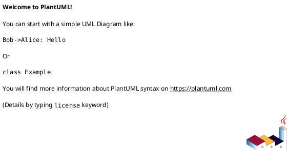

````prompt
Você é um Arquiteto de Software Sênior especialista em Java (>=17) e Spring Boot (>=3.x). Produza uma ANÁLISE TÉCNICA COMPLETA do projeto abaixo.

Contexto do projeto (preencha):
- Nome/descrição: {{resumo_do_produto}}
- Domínio do problema: {{dominio}}
- Stack: Java {{java_version|17}}, Spring Boot {{spring_boot_version|3.3}}, Build {{build_tool|Maven}}, DB {{db|PostgreSQL}}, JPA {{jpa|Hibernate/Spring Data JPA}}, Mensageria {{mensageria|n/a}}, Observabilidade {{obs|Micrometer + Prometheus + Logback}}, Infra {{infra|Docker}}
- Arquitetura atual: {{monolito_microservicos_modulos}}
- Integrações externas: {{apis_integracoes}}
- Requisitos críticos: {{sla_slo_perf_conformidade}}
- Artefatos fornecidos: {{repos_arquivos_trechos_diagramas_pipelines}}

Escala:
- Severidade: S0 bloqueante, S1 crítico, S2 alto, S3 médio, S4 baixo, S5 cosmético
- Prioridade: MoSCoW [Must, Should, Could, Won’t]
- Rubrica de pontuação (0–5) para a Matriz de Pontuação: 0 inexistente | 1 incipiente | 2 abaixo do mínimo | 3 adequado | 4 bom | 5 excelente. Critério: evidências + impacto no risco + abrangência.

Escopo da avaliação (para cada tópico: pontos fortes, fracos e críticos, com evidências e recomendações acionáveis):
1) SOLID
2) Programação Orientada a Objetos
3) Domain-Driven Design
4) Padrões de Projeto
5) Arquitetura Limpa
6) Código Limpo
7) Segurança (mapear para OWASP Top 10 e ASVS nível {{asvs|2}})

Regras:
- Seja específico: referencie arquivo e linha quando possível. Se faltar evidência, marque “inconclusivo” e liste “insumo_necessario”.
- Forneça exemplos “antes/depois” curtos quando recomendar mudança.
- Considere trade-offs de desempenho, custo e complexidade.
- Em Segurança, cubra: autenticação, autorização, validação, serialização, erros, segredos, logging, transporte, armazenamento, cabeçalhos, CORS/CSRF.
- Em Java/Spring, verifique: camadas e acoplamento, ciclos de dependência, uso de @Transactional, escopo de beans, DTO vs entidade no controller, validação Bean Validation, padrões em Services/Repositories, exceções, configuração (application.yml), Lombok/records, Testcontainers, MockMvc/WebTestClient.
- Salve dois arquivos na raiz do projeto com os mesmos dados:
  - analysis.json: conter apenas JSON válido, exatamente no formato abaixo.
  - analysis.md: conter a mesma informação em Markdown, mais legível, seguindo o template abaixo.
  - Validação do JSON: após gerar o analysis.json, valide se o conteúdo é JSON estrito válido (UTF-8, sem comentários) e aderente ao “Formato de saída (JSON)”. Se mal formatado ou com campos/chaves fora do especificado, corrija e revalide antes de salvar.
  - Validar contra o schema em prompts/refactoring/analysis.schema.json (fonte canônica). Caso ausente, validar contra analysis.schema.json na raiz, se existir.
  - Gerar um content_hash (ex.: SHA-256 do conteúdo canônico do JSON) em analysis.json e replicar o mesmo valor no topo do analysis.md para revisão humana.
  - Paths: não use "./" no meio dos caminhos (ex.: prefira "src/main/java/.../UserController.java" em vez de "src/main/java/./UserController.java").

Formato de saída (JSON) — salvar como ./analysis.json:
{
  "content_hash": "",
  "resumo_executivo": {
    "riscos_top5": [
      { "titulo": "", "severidade": "S1", "prioridade": "Must", "impacto": "", "evidencias": ["path:linha"] }
    ],
    "quick_wins_2_semanas": [
      { "titulo": "", "efeito": "", "effort": "S", "evidencias": ["path:linha"] }
    ]
  },
  "matriz_pontuacao": {
    "SOLID": { "score": 0, "severidade_media": "S3", "observacoes": "" },
    "OOP": { "score": 0, "severidade_media": "S3", "observacoes": "" },
    "DDD": { "score": 0, "severidade_media": "S3", "observacoes": "" },
    "Padroes": { "score": 0, "severidade_media": "S3", "observacoes": "" },
    "Arquitetura_Limpa": { "score": 0, "severidade_media": "S3", "observacoes": "" },
    "Codigo_Limpo": { "score": 0, "severidade_media": "S3", "observacoes": "" },
    "Seguranca": { "score": 0, "severidade_media": "S3", "observacoes": "" }
  },
  "achados_detalhados": {
    "SOLID": {
      "contexto": [],
      "pontos_fortes": [],
      "pontos_fracos": [],
      "pontos_criticos": [],
      "recomendacoes": [{ "passo": "", "effort": "S", "evidencias": ["path:linha"] }],
      "exemplo_antes": "code",
      "exemplo_depois": "code",
      "riscos_tradeoffs": ""
    },
    "OOP": {
      "contexto": [],
      "pontos_fortes": [],
      "pontos_fracos": [],
      "pontos_criticos": [],
      "recomendacoes": [{ "passo": "", "effort": "S", "evidencias": ["path:linha"] }],
      "exemplo_antes": "code",
      "exemplo_depois": "code",
      "riscos_tradeoffs": ""
    },
    "DDD": {
      "contexto": [],
      "pontos_fortes": [],
      "pontos_fracos": [],
      "pontos_criticos": [],
      "recomendacoes": [{ "passo": "", "effort": "S", "evidencias": ["path:linha"] }],
      "exemplo_antes": "code",
      "exemplo_depois": "code",
      "riscos_tradeoffs": ""
    },
    "Padroes": {
      "contexto": [],
      "pontos_fortes": [],
      "pontos_fracos": [],
      "pontos_criticos": [],
      "recomendacoes": [{ "passo": "", "effort": "S", "evidencias": ["path:linha"] }],
      "exemplo_antes": "code",
      "exemplo_depois": "code",
      "riscos_tradeoffs": ""
    },
    "Arquitetura_Limpa": {
      "contexto": [],
      "pontos_fortes": [],
      "pontos_fracos": [],
      "pontos_criticos": [],
      "recomendacoes": [{ "passo": "", "effort": "S", "evidencias": ["path:linha"] }],
      "exemplo_antes": "code",
      "exemplo_depois": "code",
      "riscos_tradeoffs": ""
    },
    "Codigo_Limpo": {
      "contexto": [],
      "pontos_fortes": [],
      "pontos_fracos": [],
      "pontos_criticos": [],
      "recomendacoes": [{ "passo": "", "effort": "S", "evidencias": ["path:linha"] }],
      "exemplo_antes": "code",
      "exemplo_depois": "code",
      "riscos_tradeoffs": ""
    },
    "Seguranca": {
      "contexto": [],
      "pontos_fortes": [],
      "pontos_fracos": [],
      "pontos_criticos": [],
      "recomendacoes": [{ "passo": "", "effort": "S", "owasp": "A01-Broken Access Control" }],
      "owasp_top10": [
        { "id": "A01", "status": "OK|Gap|Inconclusivo", "evidencias": ["path:linha"] }
      ],
      "asvs_nivel": {{asvs|2}},
      "riscos_tradeoffs": ""
    }
  },
  "ddd_focus": {
    "bounded_contexts": [],
    "aggregates": [],
    "invariantes": [],
    "repositorios": [],
    "plantuml_contexts": "@startuml\n' insira Bounded Contexts e relações\n@enduml"
  },
  "arquitetura": {
    "camadas": ["interface", "aplicacao", "dominio", "infra"],
    "violacoes_direcionais": [],
    "ports_adapters": [],
    "fluxos_principais": [],
    "plantuml_componentes": "@startuml\n' modulos, portas/adaptadores, fluxos sync/async\n@enduml"
  },
  "testes_qualidade": {
    "coverage": { "linha": null, "ramo": null },
    "tipos_testes": ["unitario", "integracao", "contrato", "e2e"],
    "gaps": []
  },
  "backlog_melhoria": [
    { "item": "", "topico": "", "prioridade": "Must", "severidade": "S2", "effort": "M", "dono": "", "prazo": "" }
  ],
  "metadados": {
    "stack_assumida": {
      "java": "{{java_version|17}}",
      "spring_boot": "{{spring_boot_version|3.3}}",
      "build": "{{build_tool|Maven}}",
      "db": "{{db|PostgreSQL}}"
    },
    "data": "YYYY-MM-DDTHH:mm:ssZ",
    "premissas": [],
    "limitacoes": []
  }
}

Template de saída (Markdown) — salvar como ./analysis.md:
# Resumo Executivo
## Top 5 Riscos
- Título: …
- Severidade: …
- Prioridade: …
- Impacto: …
- Evidências: path:linha, …

## Quick Wins (2 semanas)
- Título: …
- Efeito: …
- Esforço: …
- Evidências: path:linha, …

# Matriz de Pontuação
- SOLID: score … | severidade média … | observações …
- OOP: score … | severidade média … | observações …
- DDD: score … | severidade média … | observações …
- Padrões: score … | severidade média … | observações …
- Arquitetura Limpa: score … | severidade média … | observações …
- Código Limpo: score … | severidade média … | observações …
- Segurança: score … | severidade média … | observações …

# Achados Detalhados
## SOLID
- Contexto: …
- Pontos fortes: …
- Pontos fracos: …
- Pontos críticos: …
- Recomendações:
  - Passo: … | Esforço: … | Evidências: path:linha, …
- Exemplo (antes):
```java
// code
```
- Exemplo (depois):
```java
// code
```
- Riscos e trade-offs: …

## OOP
- Contexto: …
- Pontos fortes: …
- Pontos fracos: …
- Pontos críticos: …
- Recomendações: …
- Exemplos antes/depois: …
- Riscos e trade-offs: …

## DDD
- Contexto: …
- Pontos fortes: …
- Pontos fracos: …
- Pontos críticos: …
- Recomendações: …
- Riscos e trade-offs: …

## Padrões
- Contexto: …
- Pontos fortes: …
- Pontos fracos: …
- Pontos críticos: …
- Recomendações: …
- Riscos e trade-offs: …

## Arquitetura Limpa
- Contexto: …
- Pontos fortes: …
- Pontos fracos: …
- Pontos críticos: …
- Recomendações: …
- Riscos e trade-offs: …

## Código Limpo
- Contexto: …
- Pontos fortes: …
- Pontos fracos: …
- Pontos críticos: …
- Recomendações: …
- Riscos e trade-offs: …

## Segurança
- Contexto: …
- Pontos fortes: …
- Pontos fracos: …
- Pontos críticos: …
- Recomendações:
  - Passo: … | Esforço: … | OWASP: …
- OWASP Top 10:
  - A01: Status … | Evidências: path:linha, …
  - A02: …
- ASVS nível: {{asvs|2}}
- Riscos e trade-offs: …

# DDD Focus
- Bounded Contexts: …
- Aggregates: …
- Invariantes: …
- Repositórios: …
- Context Map (PlantUML):


# Arquitetura
- Camadas: interface, aplicacao, dominio, infra
- Violações direcionais: …
- Ports & Adapters: …
- Fluxos principais: …
- Componentes (PlantUML):


# Testes e Qualidade
- Coverage: linha … | ramo …
- Tipos de testes: unitario, integracao, contrato, e2e
- Gaps: …

# Backlog de Melhoria
- Item: … | Tópico: … | Prioridade: … | Severidade: … | Esforço: … | Dono: … | Prazo: …

# Metadados
- Stack assumida: Java {{java_version|17}}, Spring Boot {{spring_boot_version|3.3}}, Build {{build_tool|Maven}}, DB {{db|PostgreSQL}}
- Premissas: …
- Limitações: …

Observações:
- Ambos os arquivos devem refletir exatamente os mesmos dados.
- analysis.json deve ser estritamente JSON válido (UTF-8, sem comentários).
- analysis.md é uma projeção legível do mesmo conteúdo.
 - Incluir o mesmo content_hash no topo do analysis.md para permitir verificação rápida de sincronização com o analysis.json.
````
